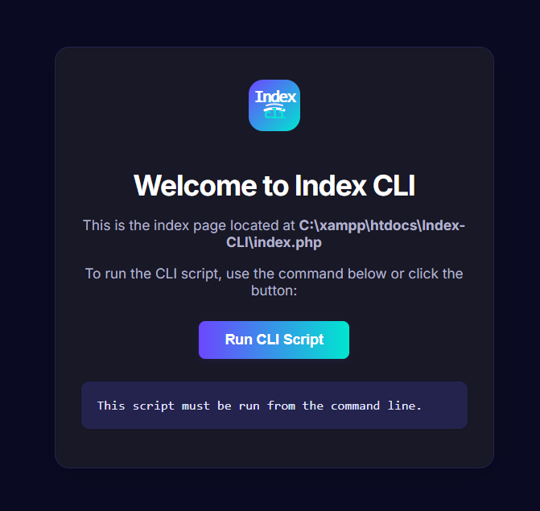

# Index CLI

<p align="center">
<svg width='64' height='64' viewBox='0 0 64 64' style='margin-bottom:18px;' xmlns='http://www.w3.org/2000/svg'><defs><linearGradient id='cli-grad' x1='0' y1='0' x2='1' y2='1'><stop offset='0%' stop-color='%236c47ff'/><stop offset='100%' stop-color='%2300e6d0'/></linearGradient></defs><rect x='0' y='0' width='64' height='64' rx='18' fill='url(%23cli-grad)'/><g><path d='M20 38c7-3 17-3 24 0' stroke='%23fff' stroke-width='3.2' fill='none' stroke-linecap='round'></path><path d='M22 32c6-2 14-2 20 0' stroke='%23e6e6ff' stroke-width='2.2' fill='none' stroke-linecap='round'></path><path d='M24 27c5-1 11-1 16 0' stroke='%2300e6d0' stroke-width='1.6' fill='none' stroke-linecap='round'></path></g><text x='50%' y='28' text-anchor='middle' font-size='22' font-family='Fira Mono, Consolas, monospace' fill='%23fff' font-weight='bold' letter-spacing='-2'>Index</text><text x='50%' y='48' text-anchor='middle' font-size='18' font-family='Fira Mono, Consolas, monospace' fill='%2300e6d0' font-weight='bold' letter-spacing='-1'>CLI</text></svg>
</p>

<div align="center">
    <sub>
        <b>Modern PHP CLI index page</b><br>
        Inspired by the ngrok dashboard, with a gradient background and clean UI.
    </sub>
</div>

## Welcome to **Index CLI**!

This project provides a simple, modern index page for your PHP CLI scripts, inspired by the ngrok dashboard style.

## Features

- Clean, responsive UI
- "Run CLI Script" button to execute your CLI PHP script (`cli.php`) directly from the browser
- Open CLI DashBoard web web terminal

## Usage

1. Place `index.php` and `cli.php` in your project directory (e.g., `/C:/xampp/htdocs/Index-CLI/`).
2. Start your local server (e.g., XAMPP/Apache).
3. Open [Website](http://localhost/Index-CLI/) in your browser.

## Example




## How it works

- The **Run CLI Script** button sends a request to `cli.php`.
- Output from `cli.php` is displayed below the button.

## File Structure

```
/Index CLI/
├── index.php
├── cli.php
├── dashboard.php
└── README.md
```
## 🛠️ Getting Started:
 <ol>
    <li>
    <strong>Clone the repository:</strong>
    <pre><code>gh repo clone gurraoptimus/Index-CLI cd Index-CLI</code></pre></li>

## Customization

- Edit `index.php` to change the UI or styles.
- Replace `cli.php` with your own CLI logic.

---

> **Location:** `/C:/xampp/htdocs/Index-CLI/index.php`