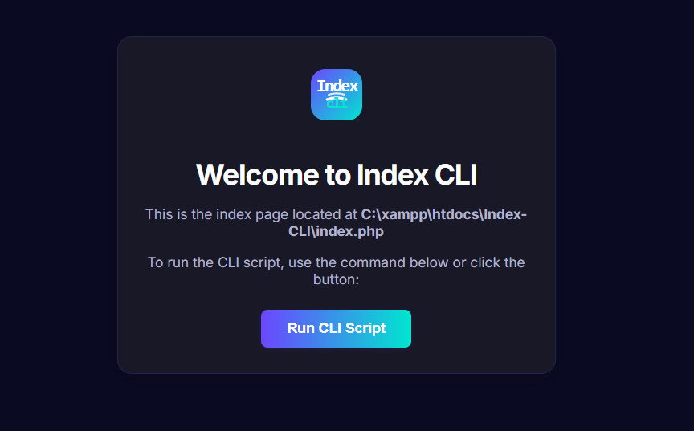

# Index CLI

Welcome to **Index CLI**!

This project provides a simple, modern index page for your PHP CLI scripts, inspired by the ngrok dashboard style.

## Features

- Clean, responsive UI
- "Run CLI Script" button to execute your CLI PHP script (`cli.php`) directly from the browser
- Displays CLI output in a styled code block

## Usage

1. Place `index.php` and `cli.php` in your project directory (e.g., `/C:/xampp/htdocs/Index-CLI/`).
2. Start your local server (e.g., XAMPP/Apache).
3. Open [http://localhost/Index-CLI/](http://localhost/Index-CLI/) in your browser.

## Example



## How it works

- The **Run CLI Script** button sends a request to `cli.php`.
- Output from `cli.php` is displayed below the button.

## File Structure

```
/CLI-index/
├── index.php
├── cli.php
└── README.md
```

## Customization

- Edit `index.php` to change the UI or styles.
- Replace `cli.php` with your own CLI logic.

---

> **Location:** `/C:/xampp/htdocs/Index-CLI/index.php`